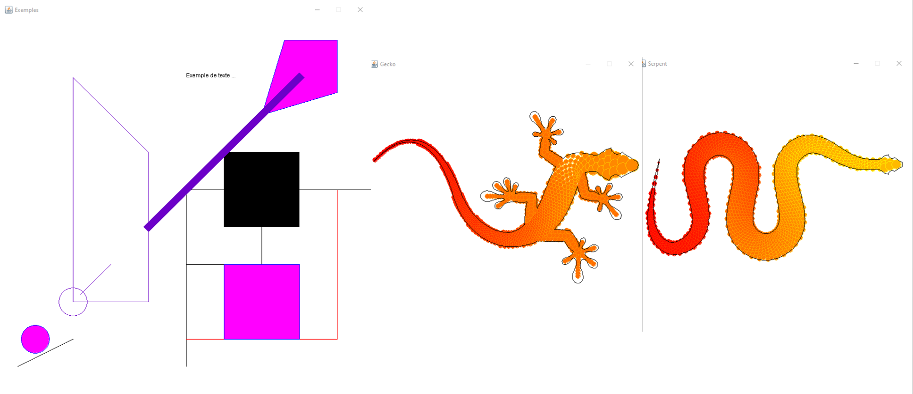

## Projet Universitaire SAE3.01 (SAE = Situation d'apprentissage évaluer)

#### Sujet du projet : 

Le langage C++ est un excellent langage de programmation, largement utilisé pour développer des applications exigeant des calculs intensifs, tels que les jeux vidéo. Cependant, bien qu'il soit très utilisé, le langage ne dispose pas d'une librairie graphique intégrée (même si plusieurs projets indépendants existent). Notre objectif est de remédier à cette lacune en développant notre propre librairie graphique pour ce dernier.

Le langage JAVA offre des caractéristiques complémentaires à celles du langage C++. Malgré ses performances de calcul moins optimales, JAVA est doté d'un ensemble complet de librairies (graphiques, bases de données, cryptage, etc.). La librairie AWT, en particulier, permet de créer des dessins complexes (voir images ci-dessous) tout en restant simple à utiliser. Ainsi, notre projet est d'exploiter les fonctionnalités de la librairie AWT depuis un programme C++. La communication entre les deux langages sera établie sous la forme d'une application client-serveur TCP/IP, où le programme C++ agira en tant que client et le programme JAVA en tant que serveur.

Cahier des charges : 

Nous allons écrire une maquette minimaliste de cette librairie. 

Le cahier des charges retenu est le suivant : 
-  Ouverture d’une fenêtre de dessin 
-  Tracé d’un segment en précisant couleur et épaisseur de tracé 
-  Tracé d’un cercle (avec couleur) 
-  Tracé d’un disque (avec couleur d’intérieur et couleur de bord) 
-  Tracé d’un polygone plein (avec couleur) 
-  Inscription d’un message 
-  La librairie graphique prendra en charge le changement des coordonnées entre monde et écran (en anglais : mapping coordinates to viewport).
